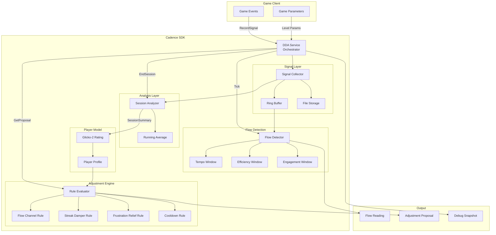
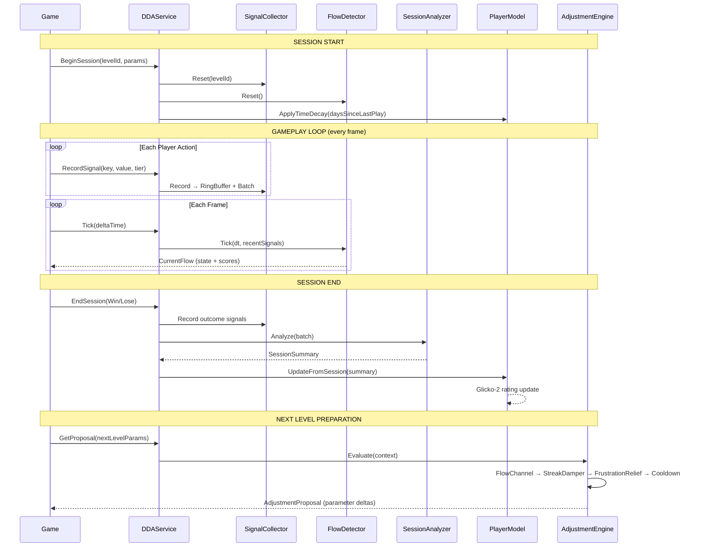
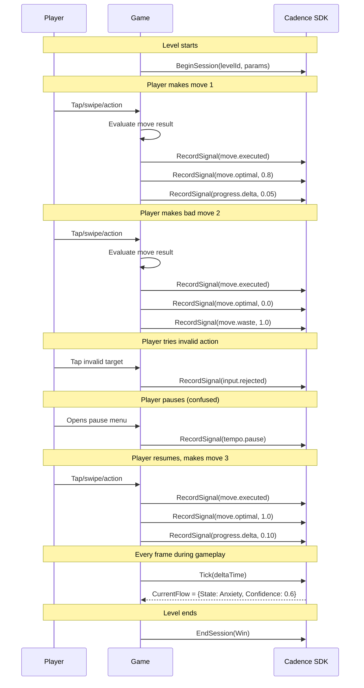
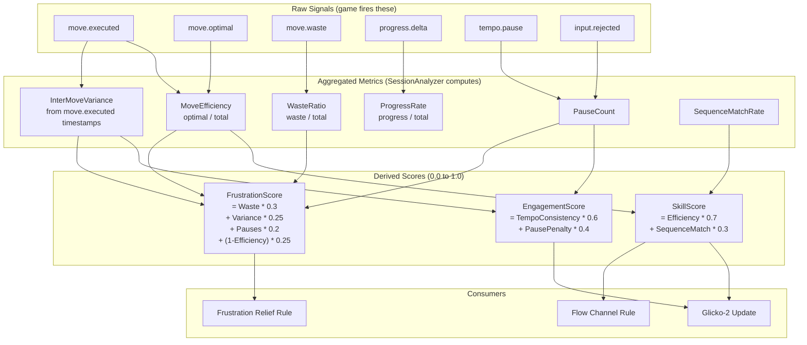
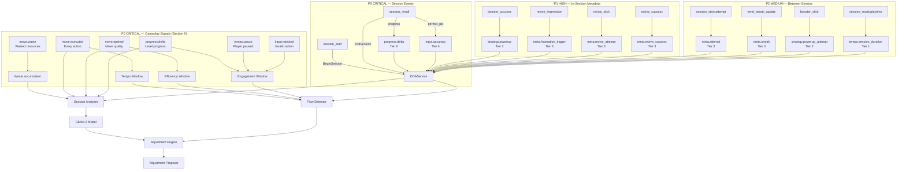
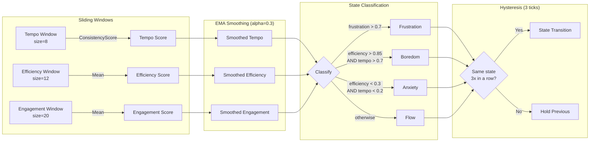
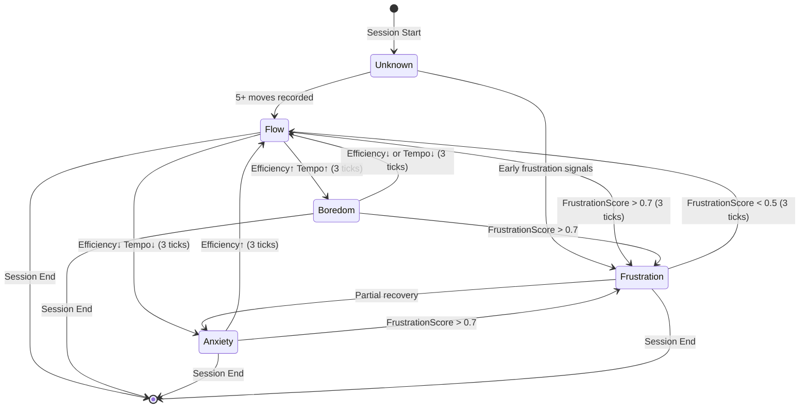
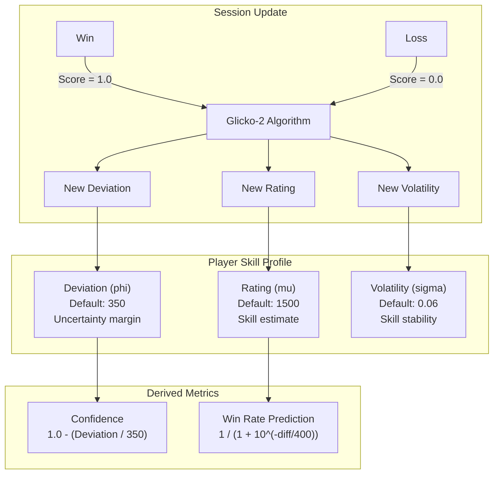
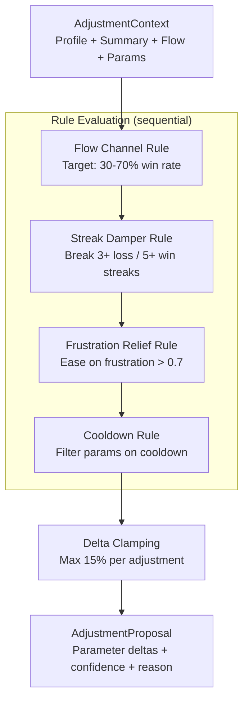

# Cadence — Dynamic Difficulty Adjustment SDK

**Product Requirements Document**

| | |
|---|---|
| **Version** | 1.0 |
| **Status** | Draft |
| **Author** | Ludaxis |
| **Date** | 2026-03-02 |
| **Platform** | Unity 2021.3+ |

---

## Table of Contents

1. [Problem Statement](#1-problem-statement)
2. [Target Users](#2-target-users)
3. [Goals and Non-Goals](#3-goals-and-non-goals)
4. [Success Metrics](#4-success-metrics)
5. [Solution Overview](#5-solution-overview)
6. [System Architecture](#6-system-architecture)
7. [Data Flow Pipeline](#7-data-flow-pipeline)
8. [Signal System](#8-signal-system)
9. [Player Performance Measurement](#9-player-performance-measurement)
10. [DDA Event Catalog](#10-dda-event-catalog)
11. [Flow Detection Engine](#11-flow-detection-engine)
12. [Player Skill Model (Glicko-2)](#12-player-skill-model-glicko-2)
13. [Adjustment Engine](#13-adjustment-engine)
14. [Public API Surface](#14-public-api-surface)
15. [Integration Guide](#15-integration-guide)
16. [Configuration Reference](#16-configuration-reference)
17. [Non-Functional Requirements](#17-non-functional-requirements)
18. [Editor Tooling](#18-editor-tooling)
19. [Testing Strategy](#19-testing-strategy)
20. [Implementation Phases](#20-implementation-phases)
21. [Decision Log](#21-decision-log)
22. [Glossary](#22-glossary)

---

## 1. Problem Statement

**Every player is different. Static difficulty is wrong for most of them.**

Mobile puzzle games lose 60-70% of players in the first week. The primary cause: a one-size-fits-all difficulty curve that is too hard for casual players and too easy for experienced ones. Studios manually tune level parameters post-launch using aggregate analytics, but this approach:

- **Reacts too slowly** — by the time a difficulty spike is identified in dashboards, thousands of players have already churned.
- **Targets the average** — tuning for the median player creates boredom for the top 30% and frustration for the bottom 30%.
- **Ignores real-time signals** — a player struggling *right now* gets no relief until they quit and become a retention statistic.

Existing DDA solutions are either black-box ML systems requiring massive datasets, or simple win-rate sliders that oscillate without understanding player state.

**Cadence solves this** by combining signal-based telemetry, Glicko-2 skill rating (the same system used in chess and competitive games), real-time psychological flow detection, and rule-based difficulty adjustment into a single, lightweight, game-agnostic Unity SDK.

---

## 2. Target Users

### Primary: Mobile Puzzle Game Engineers

Mid-level Unity engineers at studios shipping puzzle games (match-3, merge, word, tile-matching). They integrate SDKs routinely and need a drag-and-drop solution with ScriptableObject configuration.

### Secondary: Game Designers & Live-Ops

Non-engineers who tune difficulty parameters, review flow state dashboards, and configure adjustment rules through the Unity Inspector without writing code.

### Tertiary: Any Unity Game Developer

The signal system and Glicko-2 model are game-agnostic. Roguelikes, action games, educational apps, and fitness games can all benefit from adaptive difficulty.

---

## 3. Goals and Non-Goals

### Goals

| ID | Goal |
|----|------|
| G1 | Provide a drop-in Unity SDK that adapts difficulty per-player with zero backend infrastructure |
| G2 | Detect player flow state in real-time (mid-session) with < 1ms per-frame cost |
| G3 | Use Glicko-2 to build a statistically rigorous skill profile that improves with every session |
| G4 | Propose difficulty adjustments via pluggable rules that studios can customize |
| G5 | Ship with editor tools for live debugging, signal replay, and flow visualization |
| G6 | Support any game genre through a game-agnostic signal abstraction layer |

### Non-Goals

| ID | Non-Goal | Rationale |
|----|----------|-----------|
| NG1 | Cloud sync or backend services | Cadence is client-side only. Studios wire their own persistence. |
| NG2 | Machine learning / neural networks | Rules are deterministic and inspectable. ML is a future exploration. |
| NG3 | Multiplayer rating matchmaking | Glicko-2 rates player-vs-level, not player-vs-player. |
| NG4 | Analytics dashboard or reporting | Cadence emits proposals; studios own visualization. |
| NG5 | Automatic difficulty application | Cadence proposes. The game decides whether and how to apply. |

---

## 4. Success Metrics

| Metric | Target | Measurement |
|--------|--------|-------------|
| SDK initialization time | < 5ms | Profiler on low-end device (Snapdragon 665) |
| Per-frame Tick() cost | < 0.5ms | Profiler during active session with 500+ signals |
| Memory footprint | < 50 KB baseline | Profiler snapshot after construction |
| GC allocations in hot path | 0 bytes/frame | Deep profile RecordSignal + Tick |
| Binary size contribution | < 200 KB | IL2CPP stripped build delta |
| Integration time (P0 events) | < 2 hours | Engineer unfamiliar with SDK |
| Player model convergence | 5 sessions | Glicko-2 deviation drops below confidence threshold |

---

## 5. Solution Overview

Cadence is a **five-stage pipeline** that transforms raw gameplay events into actionable difficulty proposals:

```
Game Events → Signals → Analysis → Modeling → Adjustment
```

**Three value propositions:**

1. **Real-time flow detection** — Know *during gameplay* if the player is bored, frustrated, anxious, or in flow. React immediately with hints, encouragement, or mid-session adjustments.

2. **Glicko-2 skill tracking** — Build a statistically rigorous player profile that grows more confident with every session. Predict win probability for any difficulty level.

3. **Rule-based adjustment** — Four built-in rules (Flow Channel, Streak Damper, Frustration Relief, Cooldown) propose parameter changes. Studios can add custom rules.

---

## 6. System Architecture

### Component Diagram



### Module Dependency Map

```
Cadence.Runtime (zero external dependencies)
│
├── Core/
│   ├── IDDAService          ← Public interface
│   ├── DDAService           ← Sealed orchestrator
│   └── DDAConfig            ← ScriptableObject (references sub-configs)
│
├── Data/                    ← Pure data structs (no behavior)
│   ├── SignalKeys, SignalTier, SignalEntry, SignalBatch
│   ├── FlowState, FlowReading
│   ├── PlayerSkillProfile, SessionHistoryEntry
│   ├── SessionOutcome, SessionSummary
│   └── AdjustmentProposal, ParameterDelta
│
├── Signals/                 ← Collection, storage, replay
│   ├── ISignalCollector → SignalCollector
│   ├── SignalRingBuffer     (fixed-capacity circular buffer)
│   ├── ISignalStorage → FileSignalStorage
│   └── ISignalReplay → SignalReplay
│
├── Analysis/                ← Session aggregation
│   ├── ISessionAnalyzer → SessionAnalyzer
│   └── RunningAverage       (Welford's online algorithm)
│
├── PlayerModel/             ← Skill rating
│   ├── IPlayerModel → GlickoPlayerModel
│   └── PlayerModelConfig
│
├── FlowDetection/           ← Real-time state classification
│   ├── IFlowDetector → FlowDetector
│   ├── FlowDetectorConfig
│   └── FlowWindow           (sliding window statistics)
│
├── Adjustment/              ← Difficulty proposals
│   ├── IAdjustmentRule      (plugin interface)
│   ├── AdjustmentEngine
│   ├── AdjustmentEngineConfig
│   ├── AdjustmentContext
│   └── Rules/
│       ├── FlowChannelRule
│       ├── StreakDamperRule
│       ├── FrustrationReliefRule
│       └── CooldownRule
│
└── Debug/
    └── DDADebugData         (snapshot struct)
```

---

## 7. Data Flow Pipeline

### Session Lifecycle



### Signal Processing Flow

```mermaid
flowchart LR
    subgraph Input
        A[Game Event] -->|key, value, tier| B[RecordSignal]
    end

    subgraph Collection
        B --> C[Signal Collector]
        C --> D[Signal Batch<br>All session signals]
        C --> E[Ring Buffer<br>Last N signals]
    end

    subgraph RealTime ["Real-Time Path (every frame)"]
        E --> F[Flow Detector]
        F --> G[3 Sliding Windows]
        G --> H[EMA Smoothing]
        H --> I[State Classification]
        I --> J[Hysteresis Filter]
        J --> K[FlowReading]
    end

    subgraph PostSession ["Post-Session Path (on EndSession)"]
        D --> L[Session Analyzer]
        L --> M[SessionSummary]
        M --> N[Glicko-2 Update]
        N --> O[Player Profile]
    end

    subgraph Proposal ["Proposal Path (on GetProposal)"]
        O --> P[Adjustment Context]
        K --> P
        P --> Q[4 Rules Evaluated]
        Q --> R[Delta Clamping]
        R --> S[AdjustmentProposal]
    end
```



---

## 8. Signal System

### Signal Tiers

Signals are hierarchically categorized by granularity and reliability:

| Tier | Name | Granularity | Fires | Purpose |
|------|------|-------------|-------|---------|
| **0** | Decision Quality | Per-move | Every player action | Was this move good or bad? |
| **1** | Behavioral Tempo | Per-move | Between moves | How fast and consistent is the player? |
| **2** | Strategic Pattern | Per-event | On booster/resource use | What strategy is the player employing? |
| **3** | Retry & Meta | Per-session | On session start/end | How many attempts? Streaks? Gaps? |
| **4** | Raw Input | Per-input | On touch/click | Input precision and rejected attempts |

### Built-in Signal Keys

```
TIER 0 — Decision Quality
  move.executed          Player made a move (count)
  move.optimal           Move was strategically good (0.0–1.0)
  move.waste             Resources wasted on this move (float)
  resource.efficiency    Overall move efficiency (0.0–1.0)
  progress.delta         Incremental level progress (float)

TIER 1 — Behavioral Tempo
  tempo.interval         Seconds between consecutive moves
  tempo.hesitation       Delay before first action (seconds)
  tempo.pause            Player paused gameplay (count)

TIER 2 — Strategic Pattern
  strategy.powerup       Booster/power-up activated (count)
  strategy.stored        Resource stored for later (count)
  strategy.sequence      Planned sequence executed (0.0–1.0)

TIER 3 — Retry & Meta
  meta.attempt           Attempt number for this level (int)
  meta.session_gap       Days since last session (float)
  meta.abandoned         Session abandoned without finishing
  session.started        Session boundary marker
  session.ended          Session boundary marker
  session.outcome        Win(+1) / Lose(0) / Abandon(-1)

TIER 4 — Raw Input
  input.accuracy         Input precision (0.0–1.0)
  input.rejected         Invalid/rejected input (count)
```

### Signal Entry Structure

```
SignalEntry
├── Key: string              Signal identifier (from SignalKeys or custom)
├── Value: float             Magnitude (default 1.0 for binary events)
├── Tier: SignalTier         Hierarchical category (0–4)
├── MoveIndex: int           Sequence number (-1 if not move-level)
└── Timestamp
    ├── SessionTime: float   Seconds since session start
    └── FrameNumber: int     Unity frame count
```

### Ring Buffer

Stores the most recent N signals (default 512) in a zero-allocation circular buffer. Used by the Flow Detector for real-time analysis without unbounded memory growth.

| Operation | Complexity | Allocations |
|-----------|------------|-------------|
| Push | O(1) | 0 |
| Peek (most recent) | O(1) | 0 |
| CountByKey | O(n) | 0 |
| SumByKey | O(n) | 0 |
| ForEachOldestFirst | O(n) | 0 |

---

## 9. Player Performance Measurement

> **This is the most critical section of the PRD.** The analytics events in Section 10 provide session-level metadata (start, end, boosters, revives), but the core DDA pipeline — the Flow Detector and Session Analyzer — runs on **move-by-move gameplay signals**. Without these signals, the Efficiency and Tempo windows are empty, the SessionSummary computes all zeros, and the Glicko-2 model has no data to update from.

### What the Pipeline Needs

The table below shows exactly what each Cadence component consumes and what happens when the signal is missing:

| Cadence Component | Signal It Consumes | What It Feeds | If Missing |
|---|---|---|---|
| FlowDetector → **Tempo Window** | `move.executed` (timestamps) | Inter-move interval consistency | Tempo score stuck at 0.5 (neutral). No Boredom/Anxiety detection. |
| FlowDetector → **Efficiency Window** | `move.optimal` (0.0–1.0) | Move quality ratio | Efficiency score stuck at 0.5. Flow state always defaults to "Flow." |
| FlowDetector → **Engagement Window** | `progress.delta` (positive), `tempo.pause` / `input.rejected` (negative) | Player effort level | Engagement score stuck at 0.5. Frustration never detected mid-session. |
| SessionAnalyzer → **MoveEfficiency** | `move.executed` + `move.optimal` | optimal / total moves | SkillScore = 0. Glicko-2 updates are uninformed. |
| SessionAnalyzer → **WasteRatio** | `move.waste` (float) | wasted resources / total moves | FrustrationScore missing waste component (30% weight). |
| SessionAnalyzer → **ProgressRate** | `progress.delta` (float) | total progress / total moves | No measure of progress-per-move efficiency. |
| SessionAnalyzer → **InterMoveVariance** | `move.executed` (timestamps) | Tempo consistency | EngagementScore loses tempo consistency component (60% weight). |
| SessionAnalyzer → **PauseCount** | `tempo.pause` | Number of pauses | EngagementScore loses pause penalty component (40% weight). FrustrationScore loses pause signal (20% weight). |

### The 6 Core Gameplay Signals

These are the signals that the game **must** fire during gameplay. They are P0 — equal priority to session lifecycle events.

---

#### Signal 1: `move.executed` — Player Made a Move

**Signal key:** `SignalKeys.MoveExecuted`
**Tier:** 0 (Decision Quality)
**Value:** 1.0 (always)
**Frequency:** Once per player action

**What constitutes a "move"** depends on the game genre:

| Genre | What Is a Move | Example |
|-------|---------------|---------|
| Match-3 / Tile puzzle | One swap, tap, or tile placement | Player places a hex stack on the grid |
| Word game | One word submission | Player submits "CRANE" |
| Card game | One card played | Player plays a card from hand |
| Merge game | One merge action | Player merges two items |
| Action / Platformer | One significant decision | Player jumps, attacks, or uses ability |
| Turn-based | One turn completed | Player ends their turn |

**Critical:** The timestamp on this signal is what the Flow Detector uses to calculate inter-move intervals. The Tempo Window measures the **consistency** of these intervals to distinguish confident play (steady rhythm) from confused play (erratic pausing and rushing).

**Integration:**
```csharp
// Fire this EVERY time the player performs a meaningful action
void OnPlayerAction()
{
    _dda.RecordSignal(SignalKeys.MoveExecuted);
}
```

---

#### Signal 2: `move.optimal` — Was the Move Good?

**Signal key:** `SignalKeys.MoveOptimal`
**Tier:** 0 (Decision Quality)
**Value:** 0.0 (bad) to 1.0 (perfect)
**Frequency:** Once per move, paired with `move.executed`

This is the most important signal for skill measurement. It tells Cadence whether the player's action was strategically sound.

**How to measure "optimal"** depends on the game:

| Genre | Optimal (1.0) | Suboptimal (0.3–0.7) | Bad (0.0) |
|-------|--------------|----------------------|-----------|
| Tile puzzle | Placed a stack that fills eligible cells and advances the layer | Placed a stack that fills some cells but not ideal | Placed a stack that fills no cells or blocks future placements |
| Match-3 | Created a match that cascades or clears blockers | Created a basic match | Swapped tiles with no match |
| Word game | Long word with rare letters | Short common word | Invalid word attempt |
| Merge game | Merged to create a high-value item | Basic merge | Merged items that were better kept separate |

**Measurement approaches (from simplest to most sophisticated):**

1. **Binary (easiest):** Record 1.0 if the move made progress, 0.0 if not.
```csharp
bool madeProgress = cellsFilled > 0;
_dda.RecordSignal(SignalKeys.MoveOptimal, madeProgress ? 1f : 0f);
```

2. **Ratio-based:** Score proportional to how much the move achieved relative to the best possible.
```csharp
float moveScore = (float)cellsFilled / maxPossibleCellsFilled;
_dda.RecordSignal(SignalKeys.MoveOptimal, moveScore);
```

3. **Solver-compared:** Run an offline solver to determine the best move, then compare.
```csharp
int solverBestCells = solver.BestMoveScore(currentState);
float optimality = solverBestCells > 0
    ? (float)cellsFilled / solverBestCells
    : 0f;
_dda.RecordSignal(SignalKeys.MoveOptimal, optimality);
```

**Impact on Cadence:**
- **FlowDetector:** Pushes value to Efficiency Window. High mean = Boredom risk. Low mean = Anxiety/Frustration risk.
- **SessionAnalyzer:** Counts optimal moves (value > 0.5) → `MoveEfficiency` = optimal / total. Feeds `SkillScore` (70% weight).

---

#### Signal 3: `move.waste` — Resources Wasted

**Signal key:** `SignalKeys.MoveWaste`
**Tier:** 0 (Decision Quality)
**Value:** Float representing waste magnitude (0.0 = no waste)
**Frequency:** Once per move where waste occurred

"Waste" means the player's action consumed resources or opportunity without proportional benefit.

| Genre | What Is Waste |
|-------|--------------|
| Tile puzzle | Stack placed on non-eligible cell (wasted turns/moves) |
| Match-3 | Shuffle used with no improvement, move that doesn't create a match |
| Merge game | Accidentally sold a needed item, merged when storage was better |
| Word game | Timer penalty for invalid word submission |
| Action game | Missed attack, wasted ammo/mana on wrong target |

```csharp
// Example: puzzle game where moves are limited
if (cellsFilled == 0)
{
    _dda.RecordSignal(SignalKeys.MoveWaste, 1f);
}
else if (cellsFilled < expectedMinCells)
{
    float wasteAmount = 1f - ((float)cellsFilled / expectedMinCells);
    _dda.RecordSignal(SignalKeys.MoveWaste, wasteAmount);
}
```

**Impact on Cadence:**
- **SessionAnalyzer:** Accumulates total waste → `WasteRatio` = totalWaste / totalMoves. Feeds `FrustrationScore` (30% weight).

---

#### Signal 4: `progress.delta` — Incremental Progress

**Signal key:** `SignalKeys.ProgressDelta`
**Tier:** 0 (Decision Quality)
**Value:** Float representing progress increment (0.0–1.0 normalized, or absolute count)
**Frequency:** Once per move that advances the level

This measures how much closer the player got to completing the level with each action.

| Genre | What Is Progress |
|-------|-----------------|
| Tile puzzle | Cells filled / total cells to fill |
| Match-3 | Objectives completed (e.g., 3/10 red tiles cleared) |
| Merge game | Steps toward target item |
| Word game | Letters/words found toward puzzle completion |
| Level-based | Percentage of level completed |

```csharp
// Normalized: progress per move as fraction of total level
float progressIncrement = (float)cellsFilledThisMove / totalCellsInLevel;
_dda.RecordSignal(SignalKeys.ProgressDelta, progressIncrement);
```

**Impact on Cadence:**
- **FlowDetector:** Positive values push 1.0 to Engagement Window (player is making progress = engaged).
- **SessionAnalyzer:** Accumulates total → `ProgressRate` = totalProgress / totalMoves.

---

#### Signal 5: `tempo.pause` — Player Paused

**Signal key:** `SignalKeys.PauseTriggered`
**Tier:** 1 (Behavioral Tempo)
**Value:** 1.0 (always)
**Frequency:** Each time the player pauses or shows signs of disengagement

| Trigger | When to Fire |
|---------|-------------|
| Pause menu opened | Player explicitly paused the game |
| Inactivity timeout | No input for N seconds (game-specific, e.g., 10s) |
| Tab/app switch | Player backgrounded the app (on resume) |

```csharp
// On pause menu opened
_dda.RecordSignal(SignalKeys.PauseTriggered, 1f, SignalTier.BehavioralTempo);

// On inactivity detection
if (timeSinceLastInput > inactivityThreshold)
{
    _dda.RecordSignal(SignalKeys.PauseTriggered, 1f, SignalTier.BehavioralTempo);
    _inactivityFired = true;
}
```

**Impact on Cadence:**
- **FlowDetector:** Pushes 0.0 to Engagement Window (negative signal).
- **SessionAnalyzer:** Counts pauses → `PauseCount`. Feeds `EngagementScore` (40% weight via pause penalty) and `FrustrationScore` (20% weight).

---

#### Signal 6: `input.rejected` — Invalid Input

**Signal key:** `SignalKeys.InputRejected`
**Tier:** 4 (Raw Input)
**Value:** 1.0 (always)
**Frequency:** Each time the player attempts an action that the game rejects

| Genre | What Is a Rejected Input |
|-------|-------------------------|
| Tile puzzle | Tapped a stack that can't be placed (no eligible cells for that color) |
| Match-3 | Attempted swap on locked/frozen tile |
| Word game | Submitted invalid word |
| Card game | Tried to play a card they can't afford |

```csharp
// On rejected action
_dda.RecordSignal(SignalKeys.InputRejected, 1f, SignalTier.RawInput);
```

**Impact on Cadence:**
- **FlowDetector:** Pushes 0.0 to Engagement Window (negative signal, same as pause).
- High rejected input rate = confused or frustrated player.

---

### Measurement Timing Diagram



### Derived Scores from These Signals

The Session Analyzer computes three composite scores from the raw signals. These scores drive the Glicko-2 update and the Adjustment Rules:



### Quick Reference: What to Fire and When

| When | Signal | Value | Example |
|------|--------|-------|---------|
| Player performs any action | `move.executed` | 1.0 | Placed a stack, made a swap, submitted a word |
| Immediately after `move.executed` | `move.optimal` | 0.0–1.0 | How good was that action? |
| Action wasted resources | `move.waste` | magnitude | Placed stack with 0 cells filled |
| Action advanced the level | `progress.delta` | increment | Filled 3 of 60 cells = 0.05 |
| Player paused / went idle | `tempo.pause` | 1.0 | Opened pause menu, 10s inactivity |
| Game rejected player's action | `input.rejected` | 1.0 | Tapped locked tile, invalid word |
| Player used booster | `strategy.powerup` | 1.0 | Used hint/bomb/magnet |

---

## 10. DDA Event Catalog

This section maps game analytics events to Cadence signals. Events are prioritized by their impact on the DDA pipeline. **Section 9 (Player Performance Measurement) covers the core gameplay signals. This section covers session lifecycle and metadata events.**

### Priority Overview

| Priority | Events | Required For | Status |
|----------|--------|-------------|--------|
| **P0 CRITICAL** | 6 gameplay signals + 2 session events | Core pipeline: Flow Detector, Session Analyzer, Glicko-2 | Must ship |
| **P1 HIGH** | 4 events | In-session flow detection — booster use, revive behavior | Must ship |
| **P2 MEDIUM** | 6 signals | Between-session model enrichment — retry, streak, tempo | Should ship |
| **P3 LOW** | 5 events + 2 properties | Economy context and profile enrichment | Nice to have |
| **P4 SKIP** | ~50+ events | Ads, IAP, UI navigation, FTUE, cosmetics | Not wired |

---

### P0 — Session Lifecycle (CRITICAL)

> These events define the session boundaries. Without them, `BeginSession()` and `EndSession()` cannot function.

#### `session_start`

Fires when the player starts a level.

| Parameter | Type | Required | DDA Usage |
|-----------|------|----------|-----------|
| `level_id` | string | Yes | Session key. Groups all signals for this attempt. |
| `attempt` | int | Yes | Cumulative attempt count for this level. Feeds `FrustrationReliefRule`. |
| `play_type` | enum | Yes | `start` / `restart` / `replay`. DDA skips `replay` sessions. |
| `level_type` | enum | No | `common` / `daily` / `secret`. Context for adjustment rules. |
| `live_status` | enum | No | `default` / `streak_buff_1/2/3` / `infinite`. Streak context. |

**Cadence mapping:**
```csharp
_dda.BeginSession(levelId, new Dictionary<string, float>
{
    { "attempt", attemptCount },
    { "level_type_code", levelTypeCode },
    { "live_status_code", liveStatusCode }
});
```

#### `session_result`

Fires when the result screen appears (win or lose).

| Parameter | Type | Required | DDA Usage |
|-----------|------|----------|-----------|
| `result` | enum | Yes | `win` / `lose`. Determines Glicko-2 update direction. |
| `progress` | int (0–100) | Yes | Completion percentage. Maps to `progress.delta`. |
| `playtime` | float | Yes | Seconds to complete. Maps to `tempo.session_duration`. |
| `perfect_percentage` | int (0–100) | Yes | Accuracy rate. Maps to `input.accuracy`. |
| `hint_used` | int | Yes | Hint booster count. Maps to `strategy.booster_total`. |
| `bomb_used` | int | Yes | Bomb booster count. Maps to `strategy.booster_total`. |
| `magnet_used` | int | Yes | Magnet booster count. Maps to `strategy.booster_total`. |
| `continue` | int | No | Revive count. Enriches frustration scoring. |

**Cadence mapping:**
```csharp
_dda.RecordSignal(SignalKeys.ProgressDelta, progress / 100f, SignalTier.DecisionQuality);
_dda.RecordSignal(SignalKeys.InputAccuracy, perfectPercentage / 100f, SignalTier.RawInput);

float totalBoosters = hintUsed + bombUsed + magnetUsed;
_dda.RecordSignal(SignalKeys.PowerUpUsed, totalBoosters, SignalTier.StrategicPattern);
_dda.RecordSignal(SignalKeys.InterMoveInterval, playtime, SignalTier.BehavioralTempo);

_dda.EndSession(result == "win" ? SessionOutcome.Win : SessionOutcome.Lose);
```

---

### P1 — In-Session Signals (HIGH)

> These fire during active gameplay and feed the Flow Detector's real-time state classification.

#### `booster_success`

Fires when a booster is successfully activated during gameplay.

| Parameter | Type | Required | DDA Usage |
|-----------|------|----------|-----------|
| `booster_name` | enum | Yes | `hint` / `bomb` / `magnet`. Identifies assist type. |
| `requirement` | enum | No | `coin` / `ad` / `stock`. Economy pressure indicator. |

**Cadence signal:** `strategy.powerup` (Tier 2)
```csharp
_dda.RecordSignal(SignalKeys.PowerUpUsed, 1f, SignalTier.StrategicPattern);
```
**Why it matters:** High booster usage during a session indicates the player is struggling. The Flow Detector uses this to shift toward Anxiety/Frustration classification.

#### `revive_impression`

Fires when the revive prompt appears (player ran out of lives).

| Parameter | Type | Required | DDA Usage |
|-----------|------|----------|-----------|
| `progress` | int (0–100) | Yes | Progress at time of death. Low progress + death = early wall. |
| `count` | int | Yes | Times shown this session. `count > 1` = repeated deaths. |

**Cadence signal:** `meta.frustration_trigger` (Tier 3)
```csharp
_dda.RecordSignal("meta.frustration_trigger", progress / 100f, SignalTier.RetryMeta);
```
**Why it matters:** This is the strongest frustration signal. The player hit a wall and is being asked to spend resources to continue. Directly feeds `FrustrationReliefRule`.

#### `revive_click`

Fires when the player taps the revive button.

| Parameter | Type | Required | DDA Usage |
|-----------|------|----------|-----------|
| `location` | enum | Yes | `out_of_live` / `are_you_sure`. Which prompt was shown. |
| `count` | int | Yes | Times clicked this session. Multiple clicks = high engagement despite difficulty. |

**Cadence signal:** `meta.revive_attempt` (Tier 3)
```csharp
_dda.RecordSignal("meta.revive_attempt", count, SignalTier.RetryMeta);
```
**Why it matters:** Willingness to invest in continuing signals engagement despite difficulty. Combined with outcome, tells us if the investment paid off.

#### `revive_success`

Fires when the revive is completed (player paid the cost and continued).

| Parameter | Type | Required | DDA Usage |
|-----------|------|----------|-----------|
| `requirement` | enum | Yes | `coin` / `ad`. Cost type — ad requirement is higher friction. |
| `progress` | int (0–100) | Yes | Progress at revive point. |
| `count` | int | Yes | Times revived this session. |

**Cadence signal:** `meta.revive_success` (Tier 3)
```csharp
_dda.RecordSignal("meta.revive_success", 1f, SignalTier.RetryMeta);
```

---

### P2 — Between-Session Enrichment (MEDIUM)

> These enrich the player model between sessions and feed `StreakDamperRule` and `FrustrationReliefRule`.

#### `session_start.attempt` (derived from session_start)

| Parameter | Type | DDA Usage |
|-----------|------|-----------|
| `attempt` | int | High attempt count = player is stuck. Direct input to `FrustrationReliefRule`. |

**Cadence signal:** `meta.attempt` (Tier 3)
```csharp
_dda.RecordSignal(SignalKeys.AttemptNumber, attemptCount, SignalTier.RetryMeta);
```

#### `session_start.play_type` (derived from session_start)

| Parameter | Type | DDA Usage |
|-----------|------|-----------|
| `play_type` | enum | `restart` = failed and retrying. `replay` = mastered, replaying for fun (skip DDA). |

**Cadence signal:** `meta.play_type` (Tier 3). When `play_type == "replay"`, DDA adjustment is suppressed.

#### `booster_click`

Fires when the player taps a booster button (may not succeed if they can't afford it).

| Parameter | Type | DDA Usage |
|-----------|------|-----------|
| `booster_name` | enum | Which booster was attempted. |
| `requirement` | enum | `coin` when the player is broke = economy pressure signal. |

**Cadence signal:** `strategy.powerup_attempt` (Tier 2)

#### `level_streak_update`

Fires when a win streak milestone is reached or reset.

| Parameter | Type | DDA Usage |
|-----------|------|-----------|
| `milestone` | int (1–3) | Streak tier reached. |
| `status` | enum | `active` / `reset`. Directly feeds `StreakDamperRule`. |

**Cadence signal:** `meta.streak` (Tier 3)
```csharp
if (status == "reset")
    _dda.RecordSignal("meta.streak_reset", milestone, SignalTier.RetryMeta);
else
    _dda.RecordSignal("meta.streak_milestone", milestone, SignalTier.RetryMeta);
```

#### `session_result.booster_counts` (derived from session_result)

Aggregate booster dependency from `hint_used`, `bomb_used`, `magnet_used`.

**Cadence signal:** `strategy.booster_total` (Tier 2). High total = player needed heavy assistance. Zero = relied on skill alone.

#### `session_result.playtime` (derived from session_result)

| Parameter | Type | DDA Usage |
|-----------|------|-----------|
| `playtime` | float | Abnormally long = struggling. Abnormally short = too easy or gave up. |

**Cadence signal:** `tempo.session_duration` (Tier 1)

---

### P3 — Economy & Profile Context (LOW)

> Optional enrichment signals. These provide cross-session context for the player model. Implement after P0–P2 are validated.

| Event | Cadence Signal | Tier | Purpose |
|-------|---------------|------|---------|
| `item_earned` | `resource.earned` | 2 | Tracks resource income. Low earn + high spend = economy squeeze. |
| `item_spent` | `resource.spent` | 2 | Tracks spend on boosters. Rising spend = compensating for difficulty. |
| `booster_update` | `resource.stored` | 2 | Inventory snapshot. Empty inventory + high difficulty = no safety net. |
| `total_level_played` (user property) | profile enrichment | — | Player maturity indicator. More levels = higher Glicko-2 confidence. |
| `coin_balance` (user property) | profile enrichment | — | Economy health check. Near-zero constrains booster access. |

---

### P4 — Not Needed for DDA (SKIP)

> These carry no gameplay performance signal and should not be wired to Cadence.

| Category | Events | Reason |
|----------|--------|--------|
| UI Navigation | `screen_open`, `popup_open`, `button_click` | Browsing — no skill signal |
| Ad Monetization | `fullads_*`, `rewarded_*`, `ad_impression` | Business metrics only |
| IAP | `iap_impression`, `iap_click`, `iap_purchased` | Purchase behavior |
| Subscriptions | `sub_cata_*`, `sub_purchased` | Subscription funnel |
| FTUE | `ftue_main` (steps 01–28) | Tutorial — DDA is disabled during onboarding |
| Collection | `artwork_unlock`, `artwork_click` | Meta-game progression |
| Cosmetics | `avatar_update`, `frame_update` | Irrelevant to difficulty |
| Treasure Hunt | `treasure_hunt_*` | Does not reflect in-level performance |
| Account | `login`, all ULS events | Authentication |
| Content Metadata | All ACM events | Infrastructure |

---

### Event-to-Signal Mapping Diagram



---

## 11. Flow Detection Engine

### How It Works

The Flow Detector classifies the player's current psychological state by analyzing recent signals through three independent sliding windows:



### Flow States

| State | Meaning | Indicators | Game Should |
|-------|---------|------------|-------------|
| **Unknown** | Insufficient data | < 5 moves recorded | Wait. Do nothing. |
| **Flow** | Optimal challenge | Moderate efficiency, steady tempo | Maintain current difficulty |
| **Boredom** | Too easy | High efficiency (>85%), steady fast tempo (>70%) | Increase challenge |
| **Anxiety** | Too hard / fast-paced | Low efficiency (<30%), erratic tempo (<20%) | Reduce pressure |
| **Frustration** | Overwhelmed | High waste, high frustration score (>70%) | Provide relief immediately |

### Flow State Transition Diagram



### Window Scoring

**Tempo Window** — Measures inter-move interval consistency using Coefficient of Variation:
```
ConsistencyScore = Clamp01(1.0 - CV * 0.5)
Where CV = StdDev / Mean
```
- Score = 1.0: Perfect metronome-like pacing (confident player)
- Score = 0.0: Wildly erratic intervals (confused/distracted player)

**Efficiency Window** — Tracks `move.optimal` signal values. Mean represents the ratio of good-to-total moves.

**Engagement Window** — Combines positive signals (progress, powerups) and negative signals (pauses, hesitations). Mean represents overall player engagement level.

---

## 12. Player Skill Model (Glicko-2)

### Why Glicko-2

| Rating System | Tracks | Updates | Confidence | Used By |
|--------------|--------|---------|------------|---------|
| Elo | Skill | Per game | None | Chess (basic) |
| Glicko | Skill + Uncertainty | Per period | Deviation | FIDE Chess |
| **Glicko-2** | **Skill + Uncertainty + Volatility** | **Per period** | **Deviation + Volatility** | **Lichess, Cadence** |

Glicko-2 adds **volatility** — a measure of how erratic the player's skill is. A player who wins 10, then loses 10, has high volatility. A player who gradually improves has low volatility. This prevents the system from overreacting to lucky/unlucky streaks.

### Three-Parameter System



### Rating Behavior Over Time

```
Session  Result  Rating   Deviation  Volatility  Confidence
  0      —       1500     350        0.06        0.00
  1      Win     1620     290        0.06        0.17
  2      Win     1695     255        0.06        0.27
  3      Loss    1655     238        0.06        0.32
  4      Win     1690     225        0.06        0.36
  5      Win     1720     215        0.06        0.39
  ...
  20     Win     1800     120        0.05        0.66
  50     Win     1850     75         0.04        0.79
```

Key behaviors:
- **Rating** converges toward true skill with more sessions
- **Deviation** decreases with each session (more data = more confidence)
- **Volatility** decreases when outcomes are consistent
- **Confidence** (derived from deviation) approaches 1.0 as uncertainty shrinks

### Time Decay

When a player returns after inactivity, their deviation increases (uncertainty grows):

```
New Deviation = min(Current Deviation + 5.0 * daysSinceLastSession, 350)
```

A player who hasn't played in 30 days has deviation increased by 150 points, signaling the system to trust recent sessions more heavily.

### Win Rate Prediction

```
PredictedWinRate = 1 / (1 + 10^(-(Rating - LevelDifficulty) / 400))
```

| Rating - Difficulty | Predicted Win Rate |
|--------------------|--------------------|
| -400 | 9% |
| -200 | 24% |
| -100 | 36% |
| 0 | 50% |
| +100 | 64% |
| +200 | 76% |
| +400 | 91% |

The Adjustment Engine uses this prediction to keep the player in the 30-70% win rate band.

---

## 13. Adjustment Engine

### Rule Evaluation Pipeline



### Rule Details

#### Flow Channel Rule

**Purpose:** Maintain the target win rate band (default 30-70%).

```
IF winRate < 30%:
    direction = EASIER
    magnitude = DifficultyAdjustmentCurve.Evaluate(0.3 - winRate)
ELSE IF winRate > 70%:
    direction = HARDER
    magnitude = DifficultyAdjustmentCurve.Evaluate(winRate - 0.7)
ELSE:
    no adjustment (player is in the flow channel)

FOR EACH level parameter:
    delta = currentValue * magnitude * direction * 0.1
```

**Activation:** Only fires when `Profile.SessionsCompleted >= 5` (need sufficient data for reliable win rate).

#### Streak Damper Rule

**Purpose:** Prevent extended win/loss streaks that indicate the difficulty is stuck too high or too low.

```
IF 3+ consecutive losses:
    ease by 10% + 2% per additional loss
ELSE IF 5+ consecutive wins:
    harden by 5% + 1% per additional win
```

#### Frustration Relief Rule

**Purpose:** Provide immediate relief when the player is overwhelmed.

```
IF FrustrationScore > 0.7 (from SessionSummary or FlowReading):
    severity = (frustration - 0.7) / 0.3
    ease by Lerp(5%, 15%, severity)

    IF triggered by FlowReading:
        timing = MidSession (can act within current session)
    ELSE:
        timing = BeforeNextLevel
```

#### Cooldown Rule

**Purpose:** Prevent parameter oscillation by enforcing minimum intervals between adjustments.

```
IF time since last global adjustment < 60s:
    reject ALL deltas

FOR EACH proposed delta:
    IF time since this parameter was last adjusted < 120s:
        reject this delta
```

### Adjustment Proposal Output

```
AdjustmentProposal
├── Deltas: List<ParameterDelta>
│   └── ParameterDelta
│       ├── ParameterKey: string      e.g., "difficulty", "move_limit"
│       ├── CurrentValue: float       e.g., 100.0
│       ├── ProposedValue: float      e.g., 90.0
│       └── RuleName: string          e.g., "FlowChannelRule"
├── Confidence: float                 Profile.Confidence01 (0.0–1.0)
├── Reason: string                    Human-readable explanation
├── DetectedState: FlowState          State that triggered adjustment
└── Timing: AdjustmentTiming          BeforeNextLevel or MidSession
```

**The game decides whether and how to apply the proposal.** Cadence never modifies game state directly.

---

## 14. Public API Surface

### IDDAService (Primary Interface)

```csharp
public interface IDDAService
{
    // ── Session Lifecycle ──
    void BeginSession(string levelId, Dictionary<string, float> levelParameters);
    void EndSession(SessionOutcome outcome);
    bool IsSessionActive { get; }

    // ── Signal Recording ──
    void RecordSignal(string key, float value = 1f,
        SignalTier tier = SignalTier.DecisionQuality, int moveIndex = -1);

    // ── Real-Time Flow (call every frame) ──
    void Tick(float deltaTime);
    FlowReading CurrentFlow { get; }

    // ── Between-Session Adjustment ──
    AdjustmentProposal GetProposal(Dictionary<string, float> nextLevelParameters);

    // ── Player Profile ──
    PlayerSkillProfile PlayerProfile { get; }

    // ── Debug ──
    DDADebugData GetDebugSnapshot();
}
```

### DDAService (Sealed Implementation)

```csharp
// Construction
var dda = new DDAService(config);                          // Without persistence
var dda = new DDAService(config, new FileSignalStorage()); // With file persistence

// Profile persistence (call after construction, before BeginSession)
dda.LoadProfile(jsonString);
string json = dda.SaveProfile();
```

### Enums

```csharp
public enum SignalTier : byte
    { DecisionQuality, BehavioralTempo, StrategicPattern, RetryMeta, RawInput, Biometric }

public enum FlowState : byte
    { Unknown, Boredom, Flow, Anxiety, Frustration }

public enum SessionOutcome : byte
    { Win, Lose, Abandoned }

public enum AdjustmentTiming : byte
    { BeforeNextLevel, MidSession }
```

### Extension Point: Custom Rules

```csharp
public interface IAdjustmentRule
{
    string RuleName { get; }
    bool IsApplicable(AdjustmentContext context);
    void Evaluate(AdjustmentContext context, AdjustmentProposal proposal);
}

// Register a custom rule:
adjustmentEngine.AddRule(new MyCustomRule());
```

---

## 15. Integration Guide

### Phase 1: Minimal Integration (30 minutes)

```csharp
using Cadence;
using UnityEngine;
using System.Collections.Generic;

public class MyGameDDA : MonoBehaviour
{
    [SerializeField] private DDAConfig _config;
    private IDDAService _dda;

    void Start()
    {
        _dda = new DDAService(_config);

        // Load saved profile
        string saved = PlayerPrefs.GetString("cadence_profile", "");
        if (!string.IsNullOrEmpty(saved))
            ((DDAService)_dda).LoadProfile(saved);
    }

    public void OnLevelStart(string levelId, float difficulty)
    {
        _dda.BeginSession(levelId, new Dictionary<string, float>
        {
            { "difficulty", difficulty }
        });
    }

    void Update()
    {
        if (_dda.IsSessionActive)
            _dda.Tick(Time.deltaTime);
    }

    public void OnLevelEnd(bool won)
    {
        _dda.EndSession(won ? SessionOutcome.Win : SessionOutcome.Lose);

        // Save profile
        PlayerPrefs.SetString("cadence_profile", ((DDAService)_dda).SaveProfile());
    }

    public float GetNextDifficulty(float currentDifficulty)
    {
        var proposal = _dda.GetProposal(new Dictionary<string, float>
        {
            { "difficulty", currentDifficulty }
        });

        if (proposal?.Deltas != null)
        {
            foreach (var delta in proposal.Deltas)
            {
                if (delta.ParameterKey == "difficulty")
                    return delta.ProposedValue;
            }
        }
        return currentDifficulty;
    }
}
```

### Phase 2: Add In-Session Signals

```csharp
// On every player move
_dda.RecordSignal(SignalKeys.MoveExecuted);
_dda.RecordSignal(SignalKeys.MoveOptimal, wasOptimal ? 1f : 0f);

// On booster use
_dda.RecordSignal(SignalKeys.PowerUpUsed, 1f, SignalTier.StrategicPattern);

// On player pause
_dda.RecordSignal(SignalKeys.TempoPause, 1f, SignalTier.BehavioralTempo);
```

### Phase 3: React to Flow State

```csharp
void Update()
{
    if (!_dda.IsSessionActive) return;
    _dda.Tick(Time.deltaTime);

    var flow = _dda.CurrentFlow;
    if (flow.State == FlowState.Frustration && flow.Confidence > 0.7f)
    {
        ShowHintPrompt();
    }
    else if (flow.State == FlowState.Boredom && flow.Confidence > 0.8f)
    {
        ShowBonusChallenge();
    }
}
```

### Phase 4: Full Event Wiring

Wire all P0–P2 events as documented in [Section 9 (Player Performance Measurement)](#9-player-performance-measurement) and [Section 10 (DDA Event Catalog)](#10-dda-event-catalog).

---

## 16. Configuration Reference

### DDAConfig (Root ScriptableObject)

| Field | Type | Default | Purpose |
|-------|------|---------|---------|
| `PlayerModelConfig` | SO ref | — | Glicko-2 parameters |
| `FlowDetectorConfig` | SO ref | — | Flow detection thresholds |
| `AdjustmentEngineConfig` | SO ref | — | Rule parameters |
| `RingBufferCapacity` | int | 512 | Max recent signals in memory |
| `EnableSignalStorage` | bool | true | Persist signals to disk |
| `MaxStoredSessions` | int | 50 | Prune older session files |
| `EnableMidSessionDetection` | bool | true | Real-time flow detection |
| `EnableBetweenSessionAdjustment` | bool | true | Post-session difficulty proposals |

### PlayerModelConfig

| Field | Type | Default | Purpose |
|-------|------|---------|---------|
| `InitialRating` | float | 1500 | Starting Glicko-2 rating |
| `InitialDeviation` | float | 350 | Starting uncertainty |
| `InitialVolatility` | float | 0.06 | Starting volatility |
| `Tau` | float | 0.5 | Controls volatility change rate |
| `ConvergenceEpsilon` | float | 0.000001 | Newton-Raphson tolerance |
| `DeviationDecayPerDay` | float | 5.0 | Uncertainty increase per inactive day |
| `MaxDeviation` | float | 350 | Upper bound for deviation |
| `MaxHistoryEntries` | int | 20 | Session history buffer size |

### FlowDetectorConfig

| Field | Type | Default | Purpose |
|-------|------|---------|---------|
| `TempoWindowSize` | int | 8 | Moves to average for tempo |
| `EfficiencyWindowSize` | int | 12 | Moves to average for efficiency |
| `EngagementWindowSize` | int | 20 | Signals to average for engagement |
| `BoredomEfficiencyMin` | float | 0.85 | Efficiency threshold for boredom |
| `BoredomTempoMin` | float | 0.7 | Tempo threshold for boredom |
| `AnxietyEfficiencyMax` | float | 0.3 | Efficiency threshold for anxiety |
| `AnxietyTempoMax` | float | 0.2 | Tempo threshold for anxiety |
| `FrustrationThreshold` | float | 0.7 | Frustration score threshold |
| `HysteresisCount` | int | 3 | Consecutive ticks to confirm transition |
| `WarmupMoves` | int | 5 | Moves before classification begins |
| `ExponentialAlpha` | float | 0.3 | EMA smoothing factor |

### AdjustmentEngineConfig

| Field | Type | Default | Purpose |
|-------|------|---------|---------|
| `TargetWinRateMin` | float | 0.3 | Lower bound of flow channel |
| `TargetWinRateMax` | float | 0.7 | Upper bound of flow channel |
| `DifficultyAdjustmentCurve` | AnimationCurve | Linear(0,0,1,1) | Maps distance-from-band to magnitude |
| `LossStreakThreshold` | int | 3 | Consecutive losses to trigger ease |
| `WinStreakThreshold` | int | 5 | Consecutive wins to trigger harden |
| `LossStreakEaseAmount` | float | 0.10 | Base ease per loss streak |
| `WinStreakHardenAmount` | float | 0.05 | Base harden per win streak |
| `FrustrationReliefThreshold` | float | 0.7 | Frustration score trigger |
| `GlobalCooldownSeconds` | float | 60 | Min interval between any adjustment |
| `PerParameterCooldownSeconds` | float | 120 | Min interval per parameter |
| `MaxDeltaPerAdjustment` | float | 0.15 | Max 15% change per adjustment |

---

## 17. Non-Functional Requirements

### Performance Budget

| Metric | Budget | Notes |
|--------|--------|-------|
| `RecordSignal()` CPU | < 0.01ms | O(1) push to ring buffer + batch |
| `Tick()` CPU | < 0.5ms | Process new signals only |
| `EndSession()` CPU | < 2ms | One-pass analysis + Glicko-2 (max 100 iterations) |
| `GetProposal()` CPU | < 1ms | 4 rules x N parameters |
| GC allocations (hot path) | 0 bytes/frame | Ring buffer, FlowWindow, RunningAverage use inline structs |
| Memory baseline | < 50 KB | Ring buffer (~20KB) + profile (~1.3KB) + overhead |
| Binary size (IL2CPP stripped) | < 200 KB | No external dependencies |

### Platform Compatibility

| Platform | Supported | Notes |
|----------|-----------|-------|
| iOS | Yes | IL2CPP, ARM64 |
| Android | Yes | IL2CPP + Mono, ARMv7/ARM64 |
| Windows | Yes | Mono + IL2CPP |
| macOS | Yes | Mono + IL2CPP |
| WebGL | Yes | No file I/O (disable FileSignalStorage) |

| Unity Version | Supported |
|---------------|-----------|
| 2021.3 LTS | Yes (minimum) |
| 2022.3 LTS | Yes (tested) |
| Unity 6 | Yes |

### Thread Safety

All public methods on `DDAService` are **main-thread only**. Do not call from background threads or async contexts.

### Data Privacy

- All data is stored **locally** on the player's device.
- No network calls. No telemetry. No data leaves the device.
- Signal files can be pruned automatically (`MaxStoredSessions`).
- `PlayerSkillProfile` can be deleted by clearing `PlayerPrefs` or the persistence storage.

---

## 18. Editor Tooling

### DDA Debug Window

**Menu:** Cadence > Debug Window

Live inspector showing:
- Session status (active/inactive, level ID, elapsed time, signal count)
- Flow state with color-coded badge (green=Flow, blue=Boredom, yellow=Anxiety, red=Frustration)
- Flow scores (Tempo, Efficiency, Engagement, Confidence)
- Player profile (Rating, Deviation, Volatility, Sessions, Win Rate)
- Last adjustment proposal (deltas, rules, reason)

### Flow State Visualizer

**Location:** Scene View overlay (top-left corner)

Persistent badge showing current flow state during Play Mode. Updates in real-time. Color-coded for instant recognition.

### Signal Replay Window

**Menu:** Cadence > Signal Replay

Browse stored signal files, play back sessions at adjustable speed, scrub through the timeline, and inspect individual signals. Useful for diagnosing difficult levels and validating flow detection behavior.

---

## 19. Testing Strategy

### Unit Tests (52 tests across 5 test classes)

| Test Class | Tests | Covers |
|------------|-------|--------|
| `SignalCollectorTests` | 12 | Recording, batching, ring buffer wrapping, events |
| `FlowDetectorTests` | 9 | State classification, warmup, hysteresis, events |
| `GlickoPlayerModelTests` | 9 | Rating updates, deviation, time decay, serialization |
| `SessionAnalyzerTests` | 13 | Aggregation, derived scores, edge cases |
| `AdjustmentEngineTests` | 10 | All 4 rules, clamping, cooldown |

### Integration Tests (8 tests)

| Test | Covers |
|------|--------|
| Full lifecycle | Begin → Record → End → Propose |
| Multiple sessions | Profile improves over time |
| Debug snapshot | All fields populated correctly |
| Profile persistence | Save → Load roundtrip preserves state |
| Auto-end on re-begin | Abandoned outcome recorded |
| Inactive recording | Signals ignored when no session active |

### Validation Approach

| Layer | Method |
|-------|--------|
| Signal correctness | Unit tests: Record → Assert batch contains expected entries |
| Flow classification | Unit tests: Feed known signal patterns → Assert expected state |
| Glicko-2 math | Unit tests: Compare against reference Glicko-2 implementation |
| Rule behavior | Unit tests: Construct context → Assert expected deltas |
| End-to-end | Integration tests: Full session lifecycle → Assert proposal |

---

## 20. Implementation Phases

### Phase 1: P0 Core — Session + Gameplay Signals (Week 1)

> Without these, Cadence is a no-op. Session lifecycle defines boundaries; gameplay signals feed every downstream component.

| Task | Signals | Cadence APIs | Acceptance |
|------|---------|-------------|------------|
| Wire session start | `session_start` | `BeginSession()` | Session active after call |
| Wire session end | `session_result` | `EndSession()` | Profile updated, proposal available |
| **Wire move tracking** | **`move.executed`** | **`RecordSignal(MoveExecuted)` on every player action** | **Move count > 0 in Debug Window during play** |
| **Wire move quality** | **`move.optimal`** | **`RecordSignal(MoveOptimal, score)` after each move** | **MoveEfficiency > 0 in SessionSummary** |
| **Wire progress tracking** | **`progress.delta`** | **`RecordSignal(ProgressDelta, increment)` on progress** | **ProgressRate > 0 in SessionSummary** |
| **Wire waste tracking** | **`move.waste`** | **`RecordSignal(MoveWaste, amount)` on bad moves** | **WasteRatio reflects actual waste** |
| Verify Flow Detector | — | `Tick()` + `CurrentFlow` | Flow state transitions from Unknown after 5 moves |
| Verify Session Analyzer | — | `GetDebugSnapshot()` | SkillScore, EngagementScore, FrustrationScore all non-zero |

### Phase 2: P0/P1 — Engagement Signals + Boosters (Week 2)

| Task | Signals | Cadence APIs | Acceptance |
|------|---------|-------------|------------|
| **Wire pause detection** | **`tempo.pause`** | **`RecordSignal(PauseTriggered)` on pause/idle** | **PauseCount > 0 when player pauses** |
| **Wire rejected input** | **`input.rejected`** | **`RecordSignal(InputRejected)` on invalid action** | **Engagement Window receives negative signals** |
| Wire booster use | `booster_success` | `RecordSignal(PowerUpUsed)` | PowerUpsUsed increments in SessionSummary |
| Wire revive flow | `revive_impression/click/success` | `RecordSignal(meta.frustration_trigger)`, `meta.revive_*` | Frustration Relief Rule triggers on revive |
| Validate flow detection | — | `CurrentFlow` | All 4 flow states reachable during gameplay |

### Phase 3: P2 — Between-Session Enrichment (Week 3)

| Task | Signals | Cadence APIs | Acceptance |
|------|---------|-------------|------------|
| Wire attempt tracking | `session_start.attempt` | `RecordSignal(AttemptNumber)` | Frustration Relief scales with attempts |
| Wire streak tracking | `level_streak_update` | `RecordSignal(meta.streak*)` | Streak Damper Rule activates on streaks |
| Wire session duration | `session_result.playtime` | `RecordSignal(InterMoveInterval)` | Session Analyzer captures tempo |
| End-to-end validation | — | Full pipeline | Proposal deltas match expected behavior over 10+ sessions |

### Phase 4: P3 — Economy Enrichment (Week 4, optional)

| Task | Signals | Cadence APIs | Acceptance |
|------|---------|-------------|------------|
| Wire economy signals | `item_earned`, `item_spent`, `booster_update` | `RecordSignal(resource.*)` | Economy context enriches player model |
| Wire user properties | `total_level_played`, `coin_balance` | Profile enrichment | Maturity and economy indicators available |

---

## 21. Decision Log

### ADR-001: Glicko-2 over Elo for Skill Rating

**Context:** Need a rating system that handles uncertainty and variable skill levels.

**Decision:** Use Glicko-2 (three parameters: rating, deviation, volatility).

**Alternatives considered:**
- **Elo** — Simple but no confidence tracking. Can't distinguish "new player" from "inconsistent player."
- **TrueSkill** — Microsoft proprietary, designed for multiplayer matchmaking, overkill for single-player.
- **Glicko-1** — Missing volatility tracking. Can't detect erratic skill patterns.

**Consequences:** Slightly more complex update math (Newton-Raphson iteration), but provides confidence scores and handles returning players via time decay.

### ADR-002: Ring Buffer over Unbounded List for Signal Storage

**Context:** Real-time flow detection needs access to recent signals without unbounded memory growth.

**Decision:** Fixed-capacity circular buffer (default 512 entries) with zero-allocation operations.

**Alternatives considered:**
- **List\<SignalEntry\>** — Unbounded growth, requires periodic pruning, GC pressure from resizing.
- **Queue\<T\>** — Bounded but allocates on dequeue.

**Consequences:** Fixed memory footprint (~20KB). Oldest signals are silently discarded. Flow detection operates on recent window only, so this is acceptable.

### ADR-003: Rule-Based Adjustment over ML

**Context:** Need to adjust difficulty based on player state.

**Decision:** Four deterministic, configurable rules evaluated sequentially.

**Alternatives considered:**
- **Reinforcement learning** — Requires massive dataset, non-deterministic, hard to debug.
- **Decision trees** — Good for classification but doesn't handle continuous parameter adjustment well.
- **Neural network** — Black box, no explainability, overkill for the problem size.

**Consequences:** Fully inspectable and tunable. Designers can adjust thresholds in the Inspector. Studios can add custom rules via `IAdjustmentRule`. Trade-off: less adaptive than ML, but predictable and debuggable.

### ADR-004: Proposals over Direct Modification

**Context:** How should Cadence communicate difficulty adjustments to the game?

**Decision:** Return `AdjustmentProposal` with suggested parameter deltas. The game decides whether and how to apply them.

**Alternatives considered:**
- **Direct modification** — SDK modifies game parameters through a callback. Risk: unexpected behavior, hard to debug.
- **Event-driven** — Emit events that the game subscribes to. More decoupled but less structured.

**Consequences:** Maximum game control. Studios can ignore proposals, apply partially, log for analytics, or A/B test application vs. non-application. SDK never has side effects beyond its own state.

### ADR-005: Hysteresis for Flow State Stability

**Context:** Flow state classification is noisy — a single outlier signal can flip the state.

**Decision:** Require N consecutive identical classifications (default 3) before transitioning.

**Alternatives considered:**
- **No filtering** — State flickers on every tick. Unusable for game reactions.
- **Debounce timer** — Time-based instead of tick-based. Less predictable in variable frame rate scenarios.
- **Kalman filter** — Mathematically rigorous but complex to tune for discrete states.

**Consequences:** 3-tick delay before state changes (~150ms at 60fps). Eliminates jitter without significant latency. Configurable via `HysteresisCount`.

---

## 22. Glossary

| Term | Definition |
|------|-----------|
| **Adjustment Proposal** | A set of recommended parameter changes returned by the Adjustment Engine. The game decides whether to apply them. |
| **Confidence** | Derived from Glicko-2 deviation: `1.0 - (deviation / 350)`. Ranges 0.0 (no data) to ~0.8 (50+ sessions). |
| **Delta** | The difference between a parameter's current value and its proposed value. |
| **Deviation** | Glicko-2 uncertainty margin. High = uncertain (new/returning player). Low = confident (many sessions). |
| **EMA** | Exponential Moving Average. Smoothing technique that gives more weight to recent values. |
| **Flow Channel** | The target win rate band (default 30-70%) where the player is challenged but not overwhelmed. |
| **Flow State** | Classification of the player's current psychological state: Unknown, Boredom, Flow, Anxiety, Frustration. |
| **Glicko-2** | Bayesian rating system with three parameters (rating, deviation, volatility). Used in chess and competitive games. |
| **Hysteresis** | Transition guard requiring N consecutive identical classifications before the flow state changes. Prevents jitter. |
| **Level Parameter** | A game-specific numeric value (e.g., `difficulty`, `move_limit`, `time_limit`) that can be adjusted by the DDA. |
| **Rating** | Glicko-2 skill estimate. Default 1500 = average. Higher = more skilled. |
| **Ring Buffer** | Fixed-capacity circular buffer storing the most recent N signals. Overwrites oldest entries when full. |
| **Session** | One attempt at a level, from `BeginSession()` to `EndSession()`. |
| **Signal** | A single gameplay event recorded by the game and consumed by Cadence. Has a key, value, tier, and timestamp. |
| **Signal Tier** | Hierarchical category (0-4) indicating signal granularity: per-move, per-event, per-session, per-input. |
| **Volatility** | Glicko-2 measure of rating stability. High = erratic outcomes. Low = consistent skill level. |
| **Warmup** | The initial period (default 5 moves) before flow detection begins classification. Returns `Unknown` state. |
| **Win Rate** | Historical ratio of wins to total sessions. The Flow Channel Rule targets 30-70%. |
